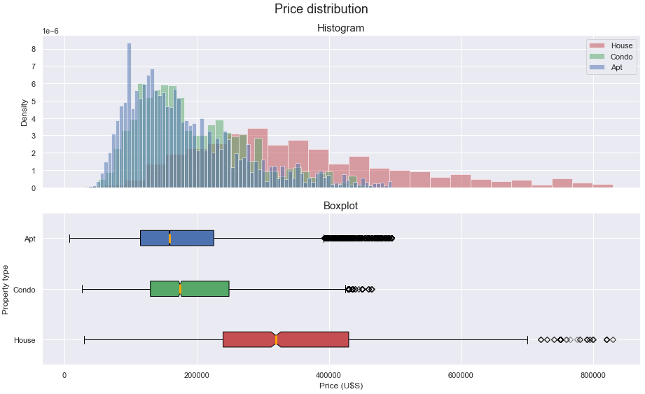
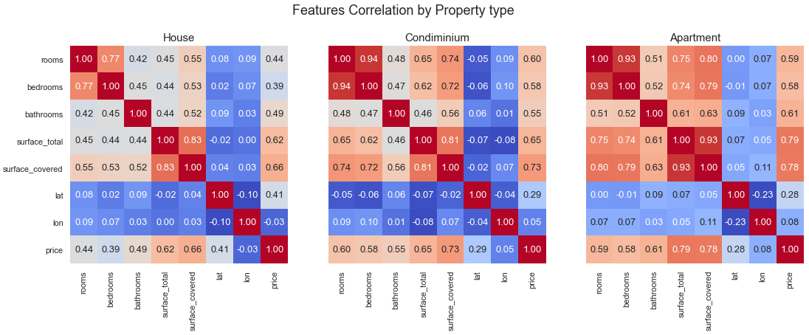
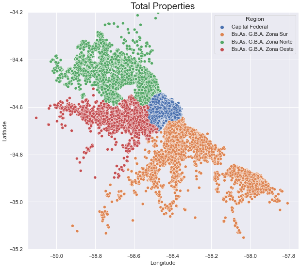

## Buenos Aires House Pricing Prediction 

### Project Overview
* Analyzed a real estate agency dataset and build different regression models for predicting estate prices in the Autonomous City of Buenos Aires area, obtaining an RMSE=27076 and R²=0.91 in the best model.
* PCA and Geographic information analysis was done.
* Optimized Linear Regression, K-Neighbors, Decision Tree and Gradient Boosting Regressors to reach the best model.
* Analyzed models errors, feature importances and residuals.
* The Project is divided in 3 Parts/Notebooks:
    * Part 1: EDA
    * Part 2: Machine Learning - First Models: Linear Regression, Knn, Decision Tree.
    * Part 3: Machine Learning - Ensemble Models: Random Forest, Gradient Boosting.

### Code and Resources Used 
**Python Version:** 3.7  
**Packages:** numpy, pandas, sklearn, matplotlib, seaborn.

### Dataset
* The original dataset is taken from Properati (www.properati.com.ar) and contains information of 146.660 houses in Buenos Aires State, represented by 19 features describing the parameters of the properties. A subset with only the Autonomous City of Buenos Aires area properties was built.
* Dataset: www.properati.com.ar/data

### EDA
* Data distributions analysis and value counts for categorical variables
* Target analysis by region and by property type grouping.
* Outliers analysis and IQR filtering.
* Correlation analysis, PCA, geographic data analysis and maps visualizations.
* Categorical data encoding.

Below are notebook captures as examples of our analysis:

### Models Building and Performance
Data was splited into train (75%) and test (25%) sets.  
A first model (benchmark 1) was developed and tested against 2 models, and the best of them (benchmark 2) was tested against 2 more complex models.  
We chose a Linear Regression model as baseline 1 because it's a simple, interpretable and at the same time powerful model. 
In the first group, a Knn model outperformed benchmark 1 and a Decision Tree model (becoming benchmark 2), and 2 types of Decision Tree ensembles were chosen to test against it in the second group: Bagging and Boosting, what we did this using a Random Forest Regressor and a Gradient Boosting Regressor respectively.  
Finally, the Gradient Boosting Regressor model outperformed the other approaches on train and test sets. 

* **Linear Regression (baseline 1)**: RMSE=51883, R²=0.6922.
* **Knn Regressor (baseline 2)**: RMSE=34054, R² =0.8674.
* **Decision Tree Regressor**: RMSE=36568, R²=0.8471.
* **Random Forest Regressor**: RMSE=27195, R²=0.9154. 
* **Gradient Boosting Regressor**: RMSE=27076, R²=0.9162.

### Metrics Chosen

**R²** for Model performance, and **𝑅𝑀𝑆𝐸** for residuals measurement.
   
* **R² (Coefficient of determination)**: measures how well models approximated actual data, letting us know which will be the models performance against unseen data.  
    Reasons for the choise:  
    - It's scale free, what let us know if our model is good regardless of the model output values: it's value is always between -∞ and 1.  
    (This is the default metric of Sklearn regression models, so it is the `score()` method output).
    
* **RMSE (Root Mean Squared Error)**: measures the Standard Deviation of residual values (differences between predicted and real values).  
    Reasons for the choise:    
    - Uses the same scale as the target variable "Price" (that's why we chose it instead of MSE).
    - It's easily differentiable, what makes it easy to use in conjunction with derivative-based methods like gradient descent (that's why we chose it instead of MAE).
